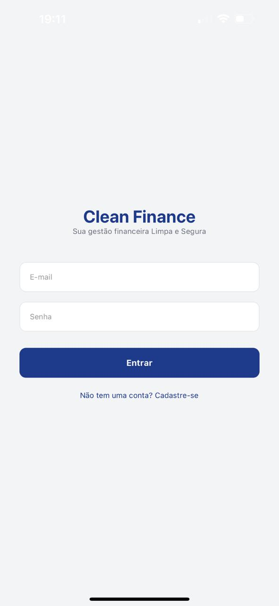
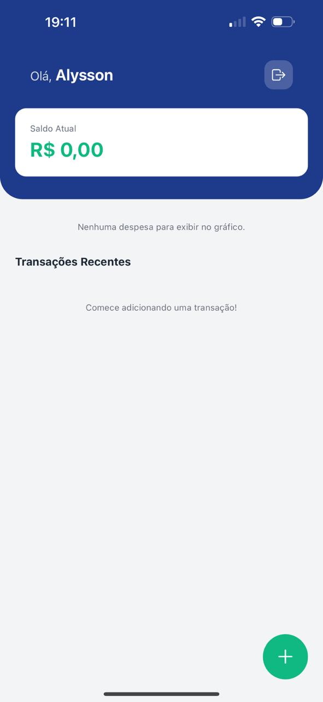
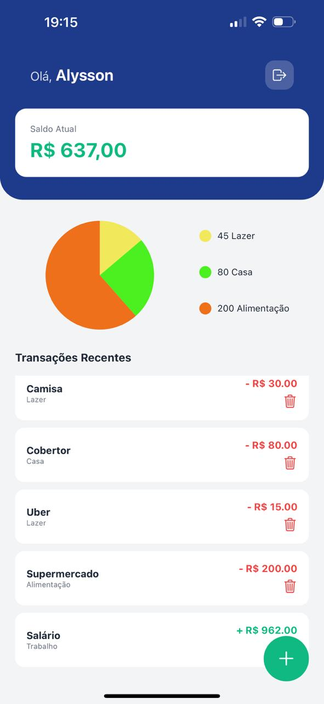

# 💰 CleanFinance App - Tech Challenge


Um aplicativo completo de controle financeiro pessoal desenvolvido para o Tech Challenge. O CleanFinance permite que os usuários gerenciem suas receitas e despesas com inteligência, visualizando o impacto financeiro em tempo real através de dashboards interativos.

## 🚀 Funcionalidades

- **Autenticação Real:** Cadastro e Login integrados ao Firebase Auth.
- **Gestão de Perfil:** Identificação personalizada com o nome do usuário no Header.
- **Fluxo de Caixa:** Adição de receitas (verde) e despesas (vermelho).
- **Dashboard Inteligente:** - Cálculo automático de saldo total.
  - Gráfico de pizza dinâmico que separa gastos por categoria.
  - Cores dinâmicas geradas automaticamente para melhor visualização.
- **Segurança:** Rotas protegidas que exigem autenticação para acesso.
- **Persistência:** Banco de dados NoSQL (Firestore) com atualização em tempo real (onSnapshot).

## 🛠️ Tecnologias Utilizadas

- [React Native](https://reactnative.dev/) + [Expo](https://expo.dev/)
- [Firebase/Firestore](https://firebase.google.com/) (Banco de dados e Auth)
- [Expo Router](https://docs.expo.dev/router/introduction/) (Navegação baseada em arquivos)
- [Victory Native](https://formidable.com/open-source/victory-native/) (Gráficos)
- [Lucide/Ionicons](https://icons.expo.fyi/) (Iconografia)

## 📱 Visual do Projeto

<div align="center">
  
  
  
  
</div>

## 🎬 Demonstração em vídeo

<p align="center">
  
</p>

> [!TIP]
> - **LINK PARA ASSISTIR AO VÍDEO DO PROJETO EM AÇÃO**
> *(https://drive.google.com/file/d/1iVovsZuORcs2_CqFxegMKqrAgjw5KJpH/view?usp=drive_link)*

## ⚙️ Como executar o projeto

1. Clone o repositório:
   ```bash
   git clone https://github.com/PinheiroAlysson/CleanFinance.git
2. Instale as dependências:
   ```bash
   npm install
3. Configure as chaves do Firebase em **src/services/firebaseConfig.js.**

4. Inicie o Projeto:
   ```bash
   npx expo start
5. Escaneie o QRcode e instale o **Expo Go** para usar o simulador e mexer no App.
---
Desenvolvido por **Alysson Pinheiro 🚀**
